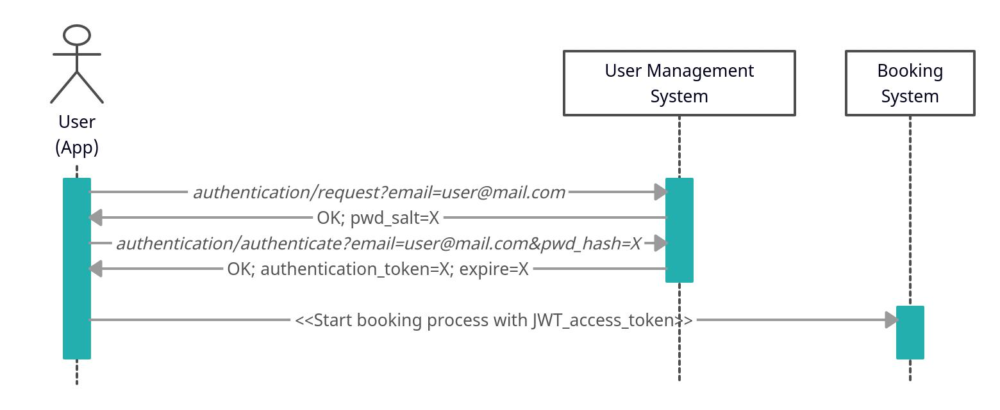

# ADDS-UserManagementSystem
This server back-end manages the creation, modification and deletion of users, as well as their permissions. This is a part of the AutonomousDroneDeliverySystem.

## Install and Setup

Generate a SSH private / public key pair and copy the keys to `collection.py`.

```bash
ssh-keygen -t rsa -b 4096 -m PEM -f jwtRS256.key
openssl rsa -in jwtRS256.key -pubout -outform PEM -out jwtRS256.key.pub
cat jwtRS256.key
cat jwtRS256.key.pub
```

Initialize the database:

```bash
flask --app flaskr init-db
```

Run the server:

```bash
flask --app flaskr/ --debug run
```

## How it works

### Authentication

1) The user first requests the password salt used for hashing the password.
2) After that the user can hash the password with the given salt and send it
    together with the email to the User Management System.
3) If the email and password (hash) are correct, the User Management System will
    reply with a JSON Web Token (JWT) [1] as the **authentication token**. This
    token is only valid for a specified time and consists the following body:
    ```JSON
    {
    "email": "user@mail.com",
    "exp": 1676273108
    }
    ```
    The authentication token is signed with the private key of the User
    Management System. The validity of the token can therefore be easily
    checked.
4) The user can now send a request to e.g. the Booking System, appending the
    authentication token, which can be validated with the provided verify
    signature and expiration time.

The following sequence diagram shows the communication between the parties:



## Sources

- [1] JWT: [https://jwt.io/](https://jwt.io/)
- [2] JWT Claims: [https://www.iana.org/assignments/jwt/jwt.xhtml](https://www.iana.org/assignments/jwt/jwt.xhtml)
